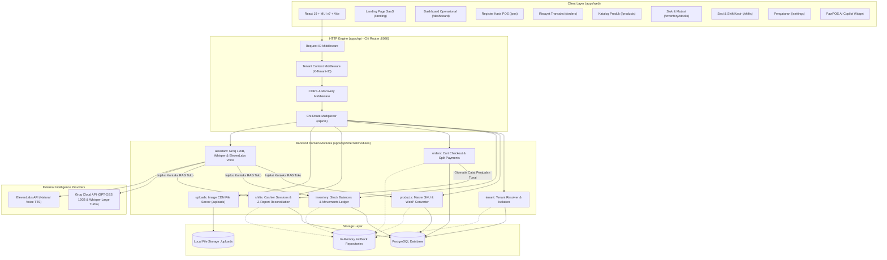
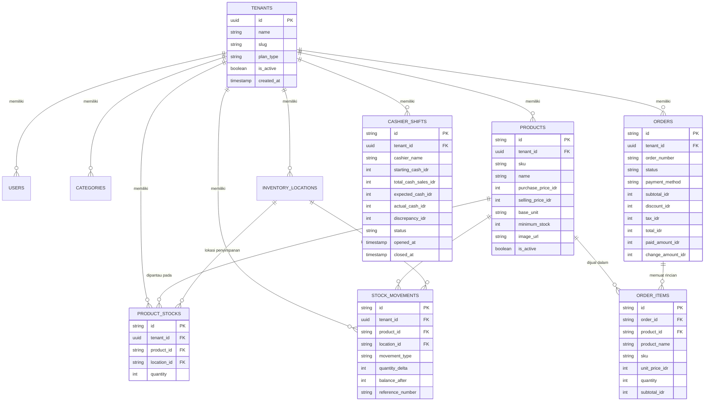

# 🧠 PawPOS Second Brain: Arsitektur Sistem & Direktori Pengetahuan AI

> [!ABSTRACT] Misi Dokumen Ini
> Dokumen ini adalah **Second Brain** resmi sistem **PawPOS (Point of Sale & Operasional Retail Pet Shop / Pet Clinic)**. 
> Dokumen ini dirancang dengan struktur terindeks agar **Agentic AI** (seperti Claude, Gemini, GPT) maupun insinyur manusia dapat memahami konteks bisnis, arsitektur monorepo, aliran data hulu-ke-hilir, aturan domain ketat (*business rules*), protokol pengujian, serta titik-titik krusial integrasi secara instan tanpa perlu melakukan eksplorasi redundan.

---

## 🗺️ 1. Mental Model: Esensi Sistem dalam 60 Detik

PawPOS adalah platform **SaaS Retail & Point of Sale Modern** yang dirancang khusus untuk bisnis berbasis hewan peliharaan (*pet shops, pet clinics, grooming centers*). 

### Nilai Utama Sistem
1. **High-Speed Operational POS**: Terminal kasir berkecepatan tinggi dengan antarmuka datar (*flat operational design*, transisi 120ms, tanpa animasi *bouncing card* yang memperlambat kasir).
2. **Dual-Persistence Engine**: Backend Go yang memiliki mekanisme **in-memory fallback otomatis** jika PostgreSQL offline atau gagal terhubung. Sistem tetap dapat berjalan 100% untuk demo, pengujian otomatis (*headless*), maupun kondisi darurat.
3. **Multi-Tenant Strict Isolation**: Setiap request diisolasi berdasarkan header `X-Tenant-ID`. Data produk, inventori, transaksi, dan shift kasir dipisahkan secara ketat.
4. **Pergantian Shift Kasir & Rekonsiliasi Kas Fisik**: Modul audit pergantian kasir dengan penghitungan denominasi fisik rupiah (Rp 100.000 s/d koin Rp 100), pencatatan selisih kas (*over/short*), dan penerbitan struk harian **Z-Report**.
5. **AI Copilot & Natural Voice Integration**: Didukung model **Groq GPT-OSS 120B** (chat cerdas dengan *Real-Time Store Context RAG*), **Whisper Large Turbo** (transkripsi suara kilat), dan **ElevenLabs Multilingual v2** (sintesis suara alami kasir).
6. **Desain Mobile-First & Safe Area Resilient**: Antarmuka web responsif penuh dengan penanganan *viewport-fit=cover* dan *safe-area-inset-bottom* untuk iPhone/Android notch & home indicator bar.

---

## 🏛️ 2. Peta Arsitektur Sistem (High-Level Topology)

Berikut visualisasi diagram interaksi komponen hulu-ke-hilir:



---

## 📂 3. Struktur Monorepo & Peta Folder

```text
ai-operational-pos/
├── OBSIDIAN.md                      # [Second Brain] Peta pengetahuan arsitektur untuk AI & Devs
├── README.md                        # Dokumentasi ringkas repositori
├── RUNBOOK.md                       # Petunjuk menjalankan server backend & frontend
├── Makefile                         # Shortcut target make (dev, build, test)
├── package.json                     # Monorepo root package.json (npm workspaces: ["apps/web"])
├── go.work                          # Go multi-module workspace
├── docker-compose.yml               # Kontainer PostgreSQL lokal
├── uploads/                         # Direktori penyimpanan aset gambar produk terunggah
│
├── apps/
│   ├── api/                         # Backend Golang (Port :8080)
│   │   ├── cmd/
│   │   │   ├── server/main.go       # Entrypoint HTTP server, DB ping & fallback
│   │   │   └── migrate/main.go      # Runner migrasi skema SQL
│   │   ├── db/migrations/           # File migrasi database PostgreSQL (00001 - 00004)
│   │   └── internal/
│   │       ├── httpserver/          # Router Chi, middleware, dan deklarasi endpoint
│   │       ├── modules/             # Modul domain independen
│   │       │   ├── assistant/       # AI Voice, Groq 120B Chat, RAG Store Context
│   │       │   ├── inventory/       # Stok gudang, mutasi masuk/keluar/penyesuaian
│   │       │   ├── orders/          # Transaksi order kasir & split tender payments
│   │       │   ├── products/        # Master produk, SKU, konversi WebP
│   │       │   ├── shifts/          # Sesi shift kasir, kas laci, Z-Report
│   │       │   ├── tenant/          # Multi-tenancy manajemen outlet
│   │       │   └── uploads/         # Handler upload file foto produk
│   │       └── platform/            # Library infrastruktur internal
│   │           ├── config/          # Pengurai environment variables
│   │           ├── envelope/        # Standar envelope format JSON response
│   │           ├── health/          # Health check endpoints (/health/live & /health/ready)
│   │           ├── logger/          # Structured logger (slog)
│   │           ├── requestid/       # Middleware penelusuran Request ID
│   │           └── tenantcontext/   # Context holder UUID tenant
│   │
│   └── web/                         # Frontend React 19 + TypeScript + Vite (Port :5173)
│       ├── index.html               # Entry HTML dengan viewport-fit=cover & theme-color
│       ├── vite.config.ts           # Konfigurasi bundler Vite & runner Vitest
│       ├── scripts/                 # Otomatisasi audit Playwright Chrome Headless
│       │   ├── audit-all-pages.mjs  # Auditor 8 halaman pada 2 viewport (Desktop & Mobile)
│       │   ├── verify-fixes.mjs     # Verifikator perbaikan layout & tangkapan visual
│       │   └── test-fixed-sidebar.mjs # Verifikator posisi sidebar pinned
│       └── src/
│           ├── main.tsx             # Root bootstrap React
│           ├── App.tsx              # App Shell, navigasi sidebar desktop, bottom nav mobile, router
│           ├── theme.ts             # Theme Material UI kustom (PawPOS Palette & Typography)
│           ├── styles.css           # Utilitas CSS global & spesifikasi kartu flat
│           ├── components/          # Komponen lintas fitur
│           │   ├── StoreSwitcher.tsx    # Dropdown & modal pendaftaran toko/tenant
│           │   ├── StaffSwitcher.tsx    # Switcher peran pengguna aktif (RBAC simulation)
│           │   ├── ErrorBoundary.tsx    # Penjaga crash antarmuka
│           │   └── ModalSlideTransition.tsx # Transisi dialog modal lembut
│           ├── features/            # Fitur modular bisnis
│           │   ├── ai-assistant/    # Copilot widget, perekam suara, integrasi Groq/ElevenLabs
│           │   ├── auth/            # Definisi peran RBAC (Owner, Manager, Cashier, Warehouse)
│           │   ├── dashboard/       # Pusat kendali operasional & metrik real-time
│           │   ├── inventory/       # Manajemen saldo stok fisik & buku mutasi
│           │   ├── landing/         # Halaman promosi SaaS publik, simulator suara AI
│           │   ├── orders/          # Riwayat struk dan audit transaksi multi-metode
│           │   ├── pos/             # Terminal kasir register kilat & keranjang belanja
│           │   ├── products/        # Master katalog SKU dan optimasi foto WebP
│           │   ├── shifts/          # Sesi shift kasir, hitung kas fisik, Z-Report
│           │   └── tenant/          # State & API multi-tenancy
│           └── utils/
│               └── currency.ts      # Pemformatan mata uang rupiah & parse nominal input
```

---

## ⚙️ 4. Aturan Bisnis & Domain Model Inti (*Core Domain Logic*)

### A. Aliran Kasir & Multi-Tender Split Payment (`/pos` & `/orders`)
1. **Metode Pembayaran**:
   - `cash`: Pembayaran tunai laci kasir. Sistem menghitung `paid_amount_idr` dan `change_amount_idr`.
   - `qris`: Pembayaran non-tunai instan digital. `paid_amount_idr` harus sama persis dengan `total_idr`.
   - `debit_card`: Pembayaran kartu EDC.
   - `split`: Pembayaran terpisah multi-tender (*Contoh: Sebagian Tunai + Sebagian QRIS*). Total nominal split wajib berjumlah tepat 100% dari total tagihan akhir.
2. **Kalkulasi Pajak & Diskon**:
   - `subtotal_idr` = Total dari $\sum (\text{unit\_price} \times \text{quantity})$.
   - `discount_idr` = Potongan harga (nominal rupiah langsung atau persentase).
   - `tax_idr` = PPN 11% (opsional, dihitung dari subtotal setelah diskon).
   - `total_idr` = $\text{subtotal} - \text{discount} + \text{tax}$.
3. **Keterkaitan Otomatis dengan Shift Kasir**:
   - Ketika pesanan tunai (`cash` atau porsi tunai pada `split`) berhasil diselesaikan, modul order secara otomatis memanggil interface `SaleRecorder` pada shift yang sedang aktif untuk menambah akumulasi `total_cash_sales_idr` di laci kasir.

### B. Siklus Sesi Shift Kasir & Rekonsiliasi Z-Report (`/shifts`)
1. **Membuka Shift Kasir**:
   - Kasir memasukkan nama kasir bertugas dan modal kas awal (*Starting Cash / Modal Laci*). Status shift menjadi `open`.
2. **Operasional Berjalan**:
   - Sistem mencatat kas masuk otomatis dari penjualan tunai.
3. **Menutup Shift Kasir (Close & Reconcile)**:
   - Kasir melakukan audit kas fisik (*cash drawer count*) menggunakan kalkulator denominasi Rupiah:
     - Lembaran: Rp 100.000, Rp 50.000, Rp 20.000, Rp 10.000, Rp 5.000, Rp 2.000, Rp 1.000.
     - Total koin receh (*coins total*).
   - **Kalkulasi Estimasi Sistem**:
     $$\text{Estimasi Kas Sistem} = \text{Modal Awal} + \text{Penjualan Kas Masuk}$$
   - **Kalkulasi Selisih Kas (*Discrepancy / Variance*)**:
     $$\text{Selisih} = \text{Kas Fisik Dihitung} - \text{Estimasi Kas Sistem}$$
     - `Selisih = 0`: Kas seimbang (*Balanced*).
     - `Selisih > 0`: Kelebihan kas fisik (*Over*).
     - `Selisih < 0`: Kekurangan kas fisik (*Short*).
4. **Penerbitan Z-Report**:
   - Menghasilkan struk audit resmi harian yang memuat identitas kasir, waktu buka-tutup, rincian modal, omzet tunai/non-tunai, rincian denominasi fisik, dan catatan selisih kas.

### C. Manajemen Inventori & Mutasi Stok (`/inventory/stocks`)
1. **Tipe Mutasi Stok (`movement_type`)**:
   - `purchase_receipt`: Penerimaan barang masuk dari supplier (menambah stok).
   - `sale`: Pengurangan stok otomatis akibat transaksi POS (mengurangi stok).
   - `adjustment`: Penyesuaian stok manual hasil stock opname fisik.
   - `opening`: Saldo persediaan awal outlet.
2. **Pencegahan Stok Negatif**:
   - Pengurangan stok tidak diizinkan jika kuantitas keluar melebihi stok yang tersedia saat ini di lokasi outlet tersebut.

### D. RAG Context Provider untuk Asisten AI (`/assistant`)
- File [`context_provider.go`](file:///c:/Users/muhri/Documents/ai-operational-pos/apps/api/internal/modules/assistant/context_provider.go) menginjeksi data toko real-time ke dalam prompt AI:
  - Katalog master produk dan harga jual.
  - Sisa stok fisik terkini di setiap lokasi gudang.
  - Ambang batas stok kritis (*minimum stock threshold*).
  - Status sesi shift kasir aktif dan saldo kas laci.
  - Riwayat penjualan harian toko.
- Hal ini memungkinkan model Groq GPT-OSS 120B menjawab pertanyaan operasional kasir secara akurat tanpa halusinasi.

---

## 🗄️ 5. Skema Database & Entitas Hubungan (ERD)



---

## 🎨 6. Design System & Standar UI Antarmuka

Antarmuka PawPOS mengacu pada prinsip **PurrCoffee Flat Operational POS Architecture**:

| Token Desain | Nilai / Implementasi | Aturan Penggunaan |
| :--- | :--- | :--- |
| **Font Utama** | `'Plus Jakarta Sans', system-ui, sans-serif` | Digunakan secara global di seluruh heading dan teks body. |
| **Brand Primary** | `#FF8A3D` (PawPOS Orange) | Aksen utama tombol CTA, tab aktif, dan status sorotan. |
| **Brand Deep Navy** | `#0F172A` & `#1E293B` | Warna teks utama, header table, dan latar belakang dark footer. |
| **Light Orange Tint** | `#FFF5ED` / `#FFF7ED` | Latar belakang pill badge, item terpilih, dan hover halus. |
| **Status Hijau Sukses** | `#16A34A` / `#059669` | Badge status aman, saldo kas aktif, struk lunas. |
| **Status Merah Peringatan** | `#DC2626` / `#EF4444` | Tombol bahaya, barang keluar, kekurangan kas (*short*). |
| **Kartu Flat** | Class `.terminal-card` | Kartu putih datar dengan border tipis `#E2E8F0`, `box-shadow: none`, radius `12px`. |
| **Transisi Halus** | `120ms` s/d `140ms ease` | Mencegah animasi lambat/memantul saat kasir mengetuk item dengan cepat. |

### Prinsip Responsif Mobile & Safe Area
1. **Viewport & Status Bar**:
   - `index.html` wajib menyertakan `viewport-fit=cover` dan `<meta name="theme-color" content="#ffffff" />` agar status bar iPhone/Android menyatu alami dengan AppBar.
2. **Bilah Navigasi Bawah (Mobile Bottom Nav)**:
   - Wajib memiliki safe area inset: `pb: 'calc(env(safe-area-inset-bottom, 0px) + 6px)'` agar tidak bertabrakan dengan *iOS Home Indicator Bar*.
   - Kontainer utama wajib diberi padding bawah: `pb: { xs: 'calc(env(safe-area-inset-bottom, 0px) + 84px)', md: 3.5 }` agar kartu terbawah tidak tersembunyi di balik navigasi.
3. **Badge Teks SKU & No. Pesanan**:
   - Selalu berikan `whiteSpace: 'nowrap'` dan `display: 'inline-flex'` pada badge SKU agar kode seperti `CAT-RC-KIT-1KG` tidak terlipat menjadi 3 baris di layar kecil.

---

## 🔐 7. Role-Based Access Control (RBAC)

Modul otorisasi terletak di [`apps/web/src/features/auth/rbac.ts`](file:///c:/Users/muhri/Documents/ai-operational-pos/apps/web/src/features/auth/rbac.ts):

| Fitur / Halaman | Owner (`owner`) | Manager (`manager`) | Kasir (`cashier`) | Petugas Gudang (`warehouse`) |
| :--- | :---: | :---: | :---: | :---: |
| **Dashboard** (`/dashboard`) | ✅ Akses Penuh | ✅ Akses Penuh | ✅ Lihat Omzet | ❌ Akses Ditolak |
| **Register Kasir POS** (`/pos`) | ✅ Akses Penuh | ✅ Akses Penuh | ✅ Operasi Kasir | ❌ Akses Ditolak |
| **Riwayat Transaksi** (`/orders`) | ✅ Akses Penuh | ✅ Akses Penuh | ✅ Lihat Struk | ❌ Akses Ditolak |
| **Katalog Produk** (`/products`) | ✅ CRUD Master | ✅ CRUD Master | 👁️ Lihat Saja | 👁️ Lihat Saja |
| **Stok & Mutasi** (`/inventory/stocks`)| ✅ Rekonsiliasi | ✅ Mutasi Barang | ❌ Akses Ditolak | ✅ Catat Masuk/Keluar |
| **Sesi & Shift Kasir** (`/shifts`) | ✅ Kelola & Audit| ✅ Buka/Tutup | ✅ Buka/Tutup | ❌ Akses Ditolak |
| **Pengaturan** (`/settings`) | ✅ Akses Penuh | ❌ Akses Ditolak | ❌ Akses Ditolak | ❌ Akses Ditolak |

---

## 🛠️ 8. Protokol Eksekusi & Instruksi Operasional untuk Agentic AI

Jika Anda adalah agen AI yang sedang membaca dokumen ini untuk melakukan perubahan, perbaikan, atau pembuatan fitur baru, **patuhi instruksi berikut**:

### 1. Cara Menjalankan Server
- **Backend API Go**:
  ```bash
  go run ./apps/api/cmd/server
  # Atau dari root repo: npm run api
  ```
  *Port standar*: `:8080` (cek status melalui endpoint `GET http://localhost:8080/health/live`).
- **Frontend Vite**:
  ```bash
  npm run dev
  # Atau masuk folder web: cd apps/web && npm run dev
  ```
  *Port standar*: `:5173`.

### 2. Standar Respons JSON Backend (Format Amplop / Envelope)
Semua endpoint Go wajib menggunakan format seragam dari package `internal/platform/envelope`:
- **Sukses**:
  ```json
  {
    "data": { ... },
    "request_id": "c1f2b3..."
  }
  ```
- **Error**:
  ```json
  {
    "error": {
      "code": "VALIDATION_ERROR",
      "message": "Deskripsi kesalahan yang manusiawi dalam Bahasa Indonesia.",
      "details": { "field": "Keterangan detail" }
    },
    "request_id": "c1f2b3..."
  }
  ```

### 3. Integritas Pengujian Wajib (*Zero Regression Policy*)
Sebelum menandai pekerjaan Anda selesai, Anda **WAJIB** menjalankan verifikasi berikut:
1. **Unit Test Suite (Vitest)**:
   ```bash
   npm --workspace apps/web run test:run
   ```
   *Ekspektasi: Seluruh 17 test file (84 tests) harus lulus 100%.*
2. **Production Bundle Compilation**:
   ```bash
   npm --workspace apps/web run build
   ```
   *Ekspektasi: `tsc -b && vite build` harus selesai tanpa ada galat TypeScript maupun Vite.*
3. **Automated Playwright Responsive Audit**:
   ```bash
   node apps/web/scripts/audit-all-pages.mjs
   ```
   *Ekspektasi: Seluruh 8 halaman lolos pengecekan horizontal overflow (0 px) pada Desktop (1440px) dan Mobile (375px).*

### 4. Hal yang Dilarang Keras (*Forbidden Anti-Patterns*)
- ❌ **JANGAN** menggunakan utility Tailwind CSS kecuali diminta secara eksplisit oleh pengguna (proyek ini menggunakan Material UI v7 dengan Vanilla CSS kustom).
- ❌ **JANGAN** menambahkan pustaka manajemen state global yang berat (seperti Redux/Zustand) untuk data yang cukup dikelola dengan localized React state dan modular API fetchers.
- ❌ **JANGAN** menghapus atau mengabaikan penanganan safe area (`env(safe-area-inset-bottom)`) pada komponen yang diposisikan tetap (*fixed position*).
- ❌ **JANGAN** membiarkan kode SKU atau nomor struk terpotong / terlipat di tengah tanda hubung (`-`) pada tabel. Selalu gunakan `whiteSpace: 'nowrap'`.
- ❌ **JANGAN** menggunakan placeholder gambar eksternal yang tidak dapat diakses offline. Gunakan generator aset internal atau path absolut SVG/PNG resmi di `/branding`.

---

## 🔮 9. Peta Jalan Pengembangan Mendatang (*Roadmap*)

1. **Phase 1: Multi-Location Real-Time Sync**
   - Penambahan sinkronisasi stok otomatis antar cabang outlet menggunakan WebSocket / Server-Sent Events (SSE).
2. **Phase 2: Offline-First IndexedDB Sync**
   - Transaksi kasir dapat dilakukan saat internet putus total dan disinkronkan secara background saat online (*PWA Service Worker*).
3. **Phase 3: Hardware Thermal Printer Protocol**
   - Direct ESC/POS thermal printer printing melalui Web Bluetooth / WebUSB API untuk printer struk 58mm & 80mm.
4. **Phase 4: WhatsApp Automation Bot**
   - Pengiriman struk digital ramah lingkungan langsung ke WhatsApp pelanggan dan notifikasi pengingat vaksinasi/grooming hewan.

---

> [!TIP] Hubungan Second Brain dengan Dokumen Terkait
> - Panduan Desain Lengkap: [[DESIGN.md]]
> - Catatan Runbook Operasional: [[RUNBOOK.md]]
> - Spesifikasi Refaktor PurrCoffee: [[PurrCoffee_POS_Design_Refactor.md]]
