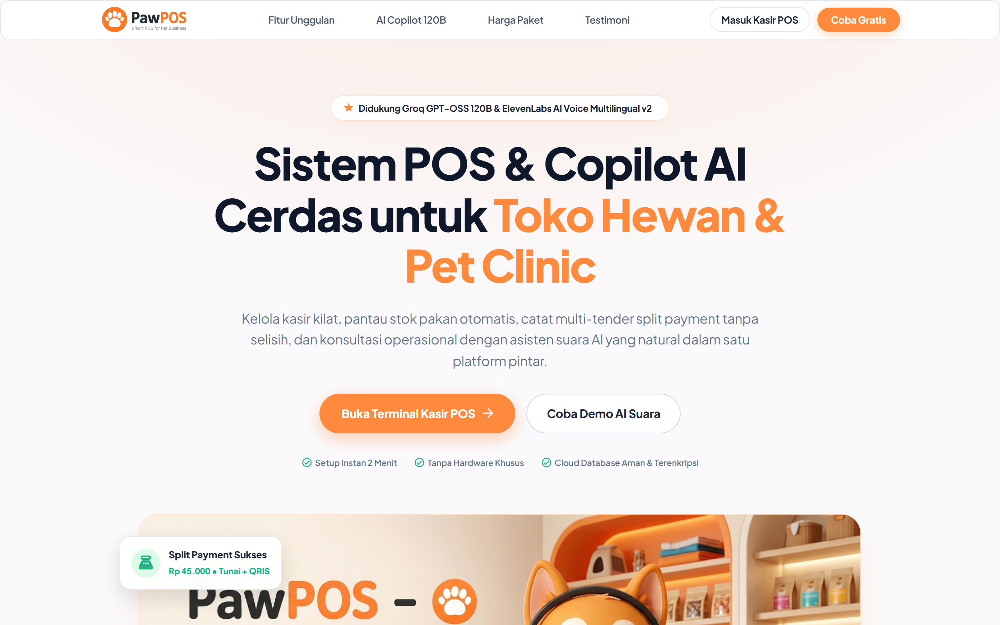
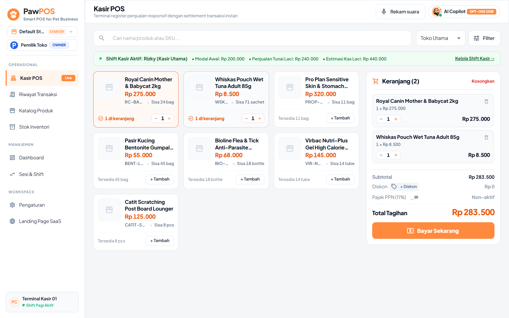
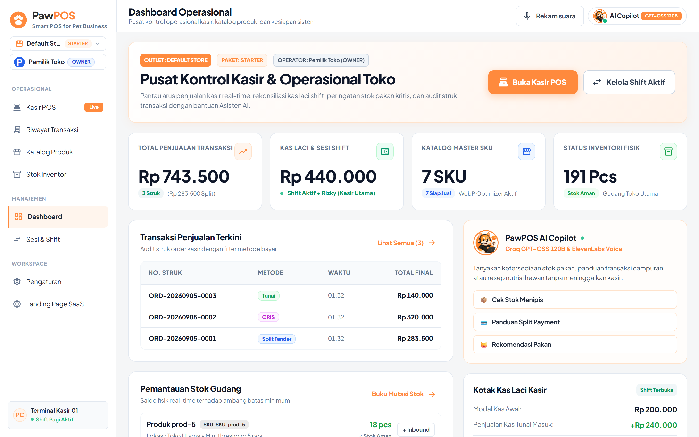
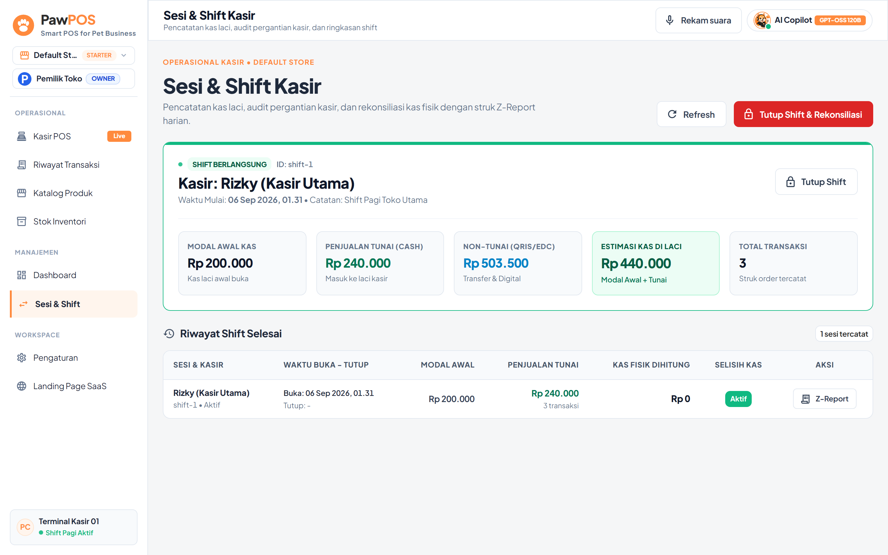
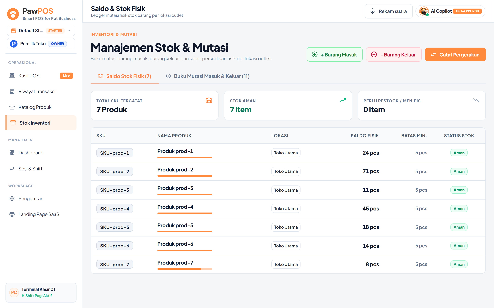
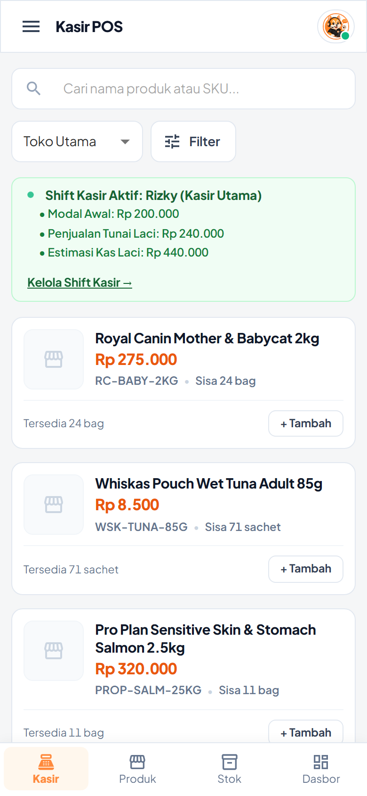
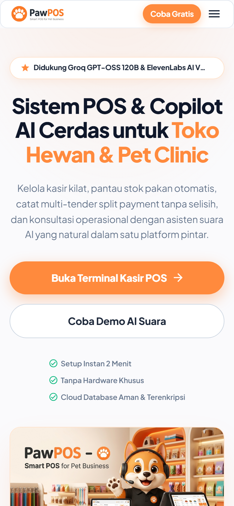

<p align="center">
  <a href="https://github.com/Ridzz05/PawPOS">
    
  </a>
</p>

<p align="center">
  <strong>Next-Generation AI Operational POS & Copilot Platform for Pet Care, Grooming & Veterinary Clinics</strong>
</p>

<p align="center">
  
  
  
  
  
  
  
  
</p>

---

## 🐾 Overview

**PawPOS** adalah sistem operasional kasir pintar (**Smart Point of Sale**) berbasis Cloud & Edge Hybrid yang dirancang khusus untuk ekosistem **Pet Shop**, klinik dokter hewan, salon grooming, dan penitipan hewan. 

Dibangun dengan arsitektur monorepo berkinerja tinggi (**Go Clean Architecture** pada backend dan **React 19 + Material-UI Modern** pada frontend), PawPOS memadukan kecepatan checkout kasir sub-detik, rekonsiliasi kas fisik anti-selisih, manajemen batch stok pakan, dan **AI Copilot Voice (Groq 120B & ElevenLabs Multilingual v2)** yang dapat diajak berkonsultasi mengenai inventori, resep nutrisi hewan, dan panduan transaksi secara hands-free.

---

## 📸 Visual Showcase (Playwright High-DPI Capture)

Semua screenshot di bawah ini ditangkap secara otomatis menggunakan skrip automasi **Playwright Retina High-DPI** langsung dari runtime sistem aktif:

### 1. Landing Page & Hero Showcase
Halaman utama SaaS yang responsif, modern, dan dilengkapi 3D visual showcase untuk menarik merchant dan pengguna baru.
<p align="center">
  
</p>

---

### 2. High-Speed POS Terminal (Live Cart & Active Shift)
Register penjualan instan dengan pencarian SKU cepat, kartu produk interaktif, live cart calculation, status shift kasir realtime, serta tombol pembayaran multi-tender.
<p align="center">
  
</p>

---

### 3. Executive Operations Dashboard
Pusat kendali merchant: pantau omset total penjualan, estimasi kas laci fisik, total SKU aktif, status inventori aman, audit transaksi terkini (Split, QRIS, Tunai), dan interaksi cepat AI Copilot.
<p align="center">
  
</p>

---

### 4. Sesi & Shift Kasir (Audit Laci & Rekonsiliasi)
Fitur akuntansi kasir ketat untuk mencegah selisih uang: pencatatan modal awal, pelacakan pemasukan tunai vs non-tunai, audit denominasi lembar uang fisik, dan pencetakan Z-Report pergantian shift.
<p align="center">
  
</p>

---

### 5. Manajemen Stok & Saldo Fisik Inventori
Pemantauan stok barang per lokasi outlet, mutasi masuk/keluar, pelacakan batas stok minimum, dan peringatan pakan menipis otomatis.
<p align="center">
  
</p>

---

### 6. Pengalaman Mobile Responsif (iOS / Android)
Optimalisasi viewport dan safe area mobile untuk tablet maupun smartphone kasir bergerak di lapangan.

| Mobile POS Terminal Register | Mobile Landing Page Showcase |
| :---: | :---: |
|  |  |

---

## ⚡ Fitur Unggulan

| Modul | Kemampuan Utama |
| :--- | :--- |
| **🚀 Kasir POS Kilat** | Pencarian instan nama/SKU, diskon fleksibel, kalkulasi pajak PPN 11%, keranjang responsif, settlement penjualan tanpa jeda. |
| **💳 Multi-Tender Split Payment** | Mendukung pembayaran kombinasi dalam 1 transaksi (contoh: Rp 100.000 Tunai + Rp 183.500 QRIS/Debit) dengan kalkulasi kembalian otomatis. |
| **🔒 Audit Shift Kasir & Laci** | Protokol pembukaan shift dengan modal awal kas, input pecahan uang fisik (*cash denomination calculator*), dan laporan Z-Report. |
| **📦 Manajemen Multi-Lokasi & Stok** | Mutasi stok barang (*opening, purchase, sale, adjustment, return*) dengan threshold peringatan stok kritis. |
| **🎙️ AI Voice Copilot RAG** | Asisten cerdas terintegrasi Groq OSS 120B dan ElevenLabs v2: tanya stok, panduan split tender, hingga konsultasi pakan langsung lewat suara. |
| **🏢 Multi-Tenant SaaS Ready** | Isolasi tenant berbasis header `X-Tenant-ID`, tier paket (*Starter, Pro, Enterprise*), dan kesiapan ekspansi cabang. |
| **🧠 Second Brain Knowledge** | Arsitektur didokumentasikan lengkap dalam format Obsidian Knowledge Graph untuk kolaborasi developer dan Agentic AI. |

---

## 🏗️ Arsitektur Sistem & Monorepo

```
ai-operational-pos/
├── apps/
│   ├── api/                     # Backend Go 1.23+ High Performance REST Service
│   │   ├── cmd/server/          # Entrypoint server HTTP & router routing
│   │   ├── internal/            # Domain logic, repositories, & business handlers
│   │   │   ├── assistant/       # AI Copilot Voice & Groq LLM integration
│   │   │   ├── auth/            # Tenant & authentication context
│   │   │   ├── inventory/       # Stock balances & movement ledger
│   │   │   ├── orders/          # Sales order, checkout & split payment engine
│   │   │   ├── products/        # Product master catalog
│   │   │   ├── shifts/          # Cash drawer shifts & audit reconciliation
│   │   │   └── tenant/          # Multi-tenant scoping & subscriptions
│   │   └── migrations/          # PostgreSQL DDL migrations
│   └── web/                     # Frontend Single Page App (SPA)
│       ├── scripts/             # Playwright automation & visual capture scripts
│       └── src/                 # React 19 + TypeScript + Material-UI components
│           ├── components/      # Reusable layout, navigation & buttons
│           └── features/        # Feature slices (pos, dashboard, shifts, etc.)
├── docs/
│   ├── branding/                # Official brand identity & enhanced logos
│   └── screenshots/             # Retina screenshots generated by Playwright
├── packages/
│   └── api-contract/            # OpenAPI 3.1 schema specification
├── scripts/
│   ├── dev.ps1                  # Unified Windows dev orchestrator
│   └── seed-demo-data.mjs       # Mock dataset seeding for demo & visual testing
├── OBSIDIAN.md                  # Comprehensive Second Brain architecture documentation
├── DESIGN.md                    # Modern UI token system, colors, & visual guidelines
└── README.md                    # Project documentation & visual showcase
```

---

## 🚀 Panduan Memulai Cepat (Quick Start)

### 1. Prasyarat
- **Go**: v1.23 atau lebih baru
- **Node.js**: v20 atau lebih baru (npm v10+)
- **Docker & Docker Compose**: Untuk instance PostgreSQL lokal
- **Google Chrome**: Untuk visual testing Playwright

### 2. Instalasi & Setup Lingkungan

Clone repository dan pasang dependencies:
```bash
git clone https://github.com/Ridzz05/PawPOS.git
cd PawPOS

# Salin konfigurasi environment
cp .env.example .env

# Pasang dependency monorepo
npm install
```

### 3. Menjalankan Database & Layanan Backend
Nyalakan PostgreSQL melalui Docker Compose:
```bash
docker compose up -d postgres
```

Jalankan backend Go API:
```bash
cd apps/api
go run ./cmd/server
```
> Server API akan aktif di `http://localhost:8080` (Healthcheck: `http://localhost:8080/health/live`).

### 4. Menjalankan Frontend Web
Di terminal terpisah dari root workspace:
```bash
npm --workspace apps/web run dev
```
> Buka browser di `http://localhost:5173` untuk mengakses PawPOS.

### 5. Seeding Data Demo & Screenshot Playwright
Untuk mengisi katalog produk, membuka shift, dan mencatat transaksi demo secara instan:
```bash
# Seed produk dan mutasi stok awal
node scripts/seed-demo-data.mjs

# Tangkap screenshot visual sistem menggunakan Playwright
node apps/web/scripts/capture-readme-screenshots.mjs
```

---

## 🧪 Validasi & Pengujian Kualitas

```bash
# Format & validasi kode Go
gofmt -w apps/api/cmd apps/api/internal
cd apps/api && go test ./... && cd ../..

# Unit test frontend (Vitest)
npm --workspace apps/web run test:run

# Build produksi frontend
npm --workspace apps/web run build

# Linting kontrak OpenAPI
npx --yes @redocly/cli lint packages/api-contract/openapi.yaml
```

---

## 📚 Second Brain & Dokumentasi Mendalam

Untuk pemahaman mendalam tentang pola perancangan, guardrails operasional, dan peta kognitif Agentic AI, silakan telusuri:

- 🧠 [**OBSIDIAN.md**](file:///c:/Users/muhri/Documents/ai-operational-pos/OBSIDIAN.md) — *Second Brain Knowledge Graph*: Arsitektur komprehensif, data lifecycle, state machine, dan panduan interoperabilitas AI.
- 🎨 [**DESIGN.md**](file:///c:/Users/muhri/Documents/ai-operational-pos/DESIGN.md) — *Design System Specification*: Standar palet warna Warm Orange `#FF6B00`, Deep Slate, tipografi Inter/Plus Jakarta Sans, dan tata letak responsive.
- 📖 [**RUNBOOK.md**](file:///c:/Users/muhri/Documents/ai-operational-pos/RUNBOOK.md) — *Engineering Runbook*: Panduan operasional teknis, pemulihan insiden, dan backup data.

---

## 📄 Lisensi & Hak Cipta

Dikelola secara terbuka oleh [**Ridzz05**](https://github.com/Ridzz05) & Tim Pengembang PawPOS.  
Dirilis di bawah lisensi [MIT License](LICENSE).
