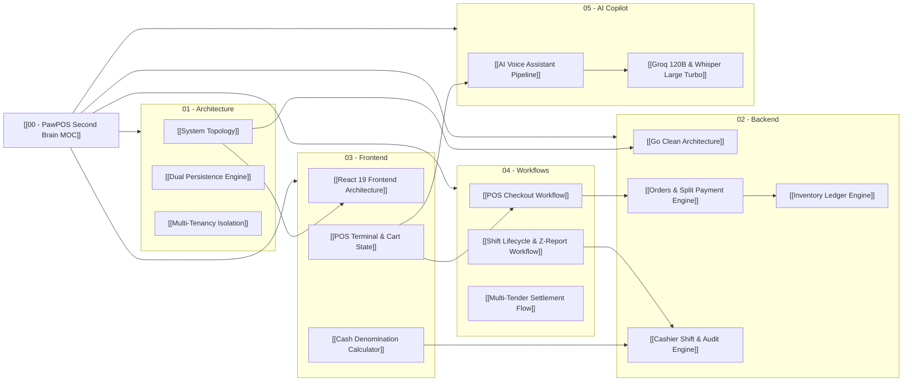

# 🧠 PawPOS Second Brain: Master Map of Content (MOC)

> [!ABSTRACT] Selamat Datang di PawPOS Vault
> Ini adalah **Second Brain** resmi sistem **PawPOS** (*Smart AI Operational Point of Sale for Pet Business*).
> Seluruh sistem—mulai dari arsitektur backend Go, antarmuka frontend React 19, mesin split payment multi-tender, audit kasir ketat, hingga pipeline AI Copilot—didokumentasikan dalam graf pengetahuan (*knowledge graph*) yang saling terhubung melalui **Obsidian Wikilinks (`[[...]]`)**.

---

## 🗺️ Peta Navigasi Pengetahuan (Knowledge Atlas)

### 🏛️ 1. Arsitektur Inti Sistem
Konsep dasar, topologi komunikasi, isolasi multi-tenant, dan ketahanan data.
- [[System Topology]] — Diagram interaksi hulu-ke-hilir antara Client, API Gateway, Domain Modules, dan Database.
- [[Dual Persistence Engine]] — Mekanisme hybrid: fallback in-memory otomatis saat PostgreSQL offline.
- [[Multi-Tenancy Isolation]] — Isolasi tenant berbasis header `X-Tenant-ID` dan aturan scoping data.
- [[Monorepo Map]] — Struktur direktori monorepo Go, React, OpenAPI contract, dan scripts.

### ⚙️ 2. Backend Engine (Go 1.23+)
Implementasi backend berkecepatan tinggi dengan Clean Architecture dan modul domain mandiri.
- [[Go Clean Architecture]] — Pembagian layer handlers, services, repositories, dan domain entities.
- [[Chi Router & Middlewares]] — Routing HTTP, request ID tracing, tenant resolver, CORS, dan recovery.
- [[Orders & Split Payment Engine]] — Mesin kalkulasi checkout pesanan, validasi nominal, dan split pembayaran.
- [[Cashier Shift & Audit Engine]] — Pengelolaan sesi shift kasir, kas laci, denominasi, dan struk Z-Report.
- [[Inventory Ledger Engine]] — Pencatatan saldo fisik pakan, batch pergerakan stok, dan threshold peringatan.
- [[Products & WebP Engine]] — Katalog master SKU produk dan pipeline konversi kompresi gambar WebP.
- [[Database Schema & DDL]] — Skema relasional PostgreSQL, tabel transaksi, index, dan foreign keys.

### 💻 3. Frontend Application (React 19 + TypeScript + Vite)
Antarmuka kasir operasional modern dengan Material-UI v7 dan optimasi kecepatan checkout.
- [[React 19 Frontend Architecture]] — Desain antarmuka, routing, state transitions, dan client API contracts.
- [[POS Terminal & Cart State]] — State machine keranjang belanja, kalkulasi diskon/pajak, dan settlement instan.
- [[Cash Denomination Calculator]] — Kalkulator interaktif lembaran uang rupiah untuk audit kasir tanpa salah hitung.
- [[Mobile-First & Safe Area System]] — Adaptasi viewport mobile, notch iPhone, dan navigasi bawah safe area.
- [[Design System & Tokens]] — Standar warna Warm Orange `#FF6B00`, Deep Slate, tipografi, dan komponen UI.

### 🔄 4. Alur Kerja & Workflow Sistem (End-to-End)
Diagram dan alur operasional toko sehari-hari dari buka toko hingga tutup shift.
- [[POS Checkout Workflow]] — Alur pemindaian barcode/SKU, penambahan item, hingga cetak struk penjualan.
- [[Multi-Tender Settlement Flow]] — Alur pembayaran kombinasi (Tunai + QRIS / Kartu Debit) dan kalkulasi kembalian.
- [[Shift Lifecycle & Z-Report Workflow]] — Alur pembukaan modal awal, pergantian kasir, hingga rekonsiliasi akhir.
- [[Inventory Movement Workflow]] — Alur penerimaan barang supplier, mutasi keluar, dan penyesuaian stok.

### 🤖 5. AI Copilot & Voice RAG Engine
Kecerdasan buatan operasional kasir untuk asisten hands-free.
- [[AI Voice Assistant Pipeline]] — Alur transkripsi suara, pengenalan maksud (intent), dan sintesis suara.
- [[Groq 120B & Whisper Large Turbo]] — Integrasi model bahasa Groq GPT-OSS 120B dan transkripsi audio kilat.
- [[ElevenLabs Voice Synthesis]] — Sintesis suara kasir berbahasa Indonesia yang alami dan ekspresif.

### 🚀 6. DevOps, Deployment & Keandalan
Operasional server, deployment cloud, dan pemulihan sistem.
- [[Local Dev & Testing Runbook]] — Panduan menjalankan backend Go, Vite frontend, Docker, dan pengujian Vitest.
- [[Deployment Guide (PaaS & VPS)]] — Strategi hosting Go API di Railway, Render, atau VPS Ubuntu Docker.
- [[Offline Fallback & Reliability]] — Panduan keandalan sistem saat internet atau database terganggu.

---

## 🧭 Diagram Hubungan Antar Modul (Core Interaction Graph)

---

> [!TIP] Cara Menggunakan Vault Ini
> 1. Buka folder `vault/` langsung menggunakan aplikasi [Obsidian](https://obsidian.md/).
> 2. Tekan `Ctrl + G` (atau klik ikon **Graph View** di bilah samping) untuk melihat jaring keterhubungan antar berkas secara interaktif.
> 3. Gunakan `Ctrl + O` untuk mencari topik apa pun secara instan.
