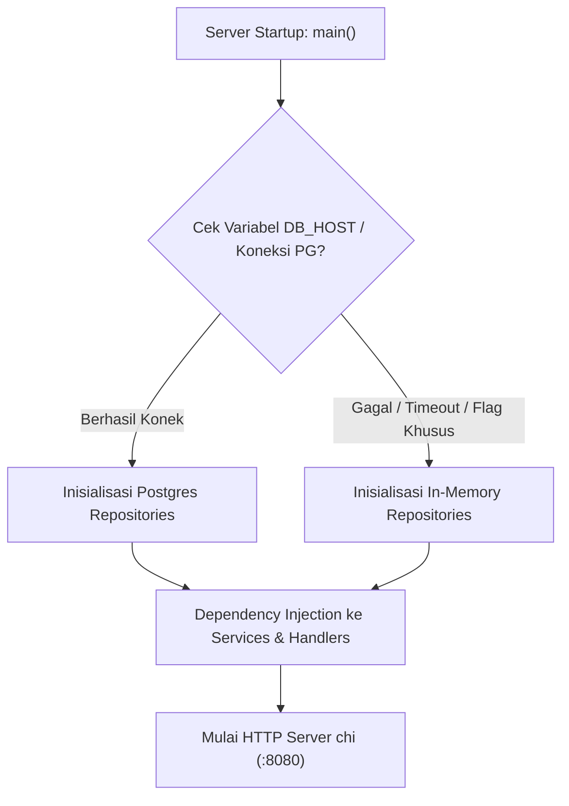

# 🔄 Dual Persistence Engine

**Dual Persistence Engine** adalah inovasi arsitektur kritis pada **PawPOS** yang menjamin server backend Go dapat beroperasi dalam dua mode penyimpanan:
1. **Database Mode (PostgreSQL 16)**: Mode produksi standar dengan integritas ACID, foreign key constraints, dan persistensi permanen di disk.
2. **In-Memory Fallback Mode**: Mode otomatis saat koneksi PostgreSQL tidak tersedia, dalam pengujian otomatis (*CI/CD*), demonstrasi langsung, atau saat kontainer Docker database mati.

---

## 🎯 Mengapa Dual-Persistence?

Sistem Point of Sale (POS) di toko fisik tidak boleh berhenti bekerja (*zero downtime requirement*). Kasir di kasir depan tidak boleh terhambat hanya karena proses migrasi database atau kegagalan koneksi database sementara.



---

## 🧩 Kontrak Antarmuka (Interface Abstraction)

Setiap modul di `apps/api/internal/` mendefinisikan antarmuka Go (*Repository Interface*) yang diimplementasikan oleh dua struct berbeda:

Contoh pada modul **Products**:
```go
type Repository interface {
    Create(ctx context.Context, p *Product) error
    GetByID(ctx context.Context, tenantID, id string) (*Product, error)
    List(ctx context.Context, tenantID string, filter ListFilter) ([]*Product, error)
    Update(ctx context.Context, p *Product) error
    Delete(ctx context.Context, tenantID, id string) error
}
```

Dua implementasi konkrit:
- `PostgresRepository`: Mengeksekusi query SQL via `*pgxpool.Pool` atau `database/sql`.
- `MemoryRepository`: Menyimpan data dalam slice/map yang dilindungi `sync.RWMutex` agar aman diakses ratusan goroutine secara bersamaan (*thread-safe*).

---

## ⚖️ Matriks Perbandingan Mode

| Aspek | PostgreSQL Mode | In-Memory Fallback Mode |
| :--- | :--- | :--- |
| **Persistensi Data** | Permanen di disk | Sementara (reset saat server restart) |
| **Kecepatan Baca/Tulis** | Sub-milidetik (~1-5ms) | Mikrodetik (< 0.1ms) |
| **Ketergantungan Eksternal** | Butuh Docker / Database server | Nol ketergantungan (Zero dependency) |
| **Isolasi Multi-Tenant** | Kueri `WHERE tenant_id = $1` | Filter map berdasarkan key `tenant_id` |
| **Penggunaan Ideal** | Produksi toko nyata & staging | Unit testing, demo offline, verifikasi instan |

---

## 🔒 Thread Safety pada In-Memory Engine

Ketika berjalan di mode memori, struktur data dilindungi oleh lock mutex:
```go
type MemoryShiftRepo struct {
    mu     sync.RWMutex
    shifts map[string]*Shift
}

func (r *MemoryShiftRepo) GetByID(ctx context.Context, tenantID, id string) (*Shift, error) {
    r.mu.RLock()
    defer r.mu.RUnlock()
    
    s, exists := r.shifts[id]
    if !exists || s.TenantID != tenantID {
        return nil, ErrShiftNotFound
    }
    return s, nil
}
```

Hal ini memastikan tidak terjadi *data race condition* saat kasir melakukan transaksi secara serentak.

---
*Kembali ke:* [[00 - PawPOS Second Brain MOC]] | *Topik Terkait:* [[System Topology]], [[Database Schema & DDL]]
