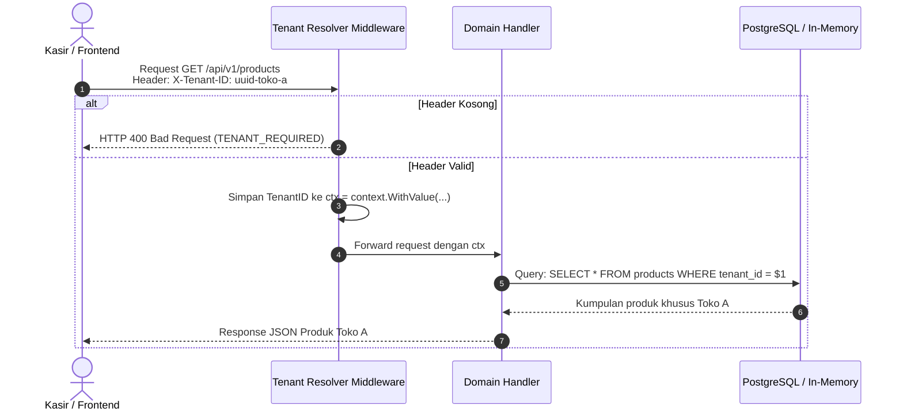

# 🏢 Multi-Tenancy Isolation

**PawPOS** didesain dari awal sebagai arsitektur **Multi-Tenant SaaS**. Artinya, satu instalasi server dan database dapat melayani ratusan toko pet shop berbeda secara bersamaan tanpa ada risiko kebocoran data (*data leak*) antar pemilik toko.

---

## 🔑 Strategi Isolasi: Header `X-Tenant-ID`

Setiap permintaan HTTP dari client frontend wajib menyertakan header:
```http
X-Tenant-ID: 00000000-0000-0000-0000-000000000001
```

Jika header tidak diberikan:
1. Middleware backend akan memeriksa apakah ada default tenant yang ditentukan.
2. Jika tidak ada, permintaan akan ditolak dengan status HTTP `400 Bad Request` atau `401 Unauthorized` dengan error code `TENANT_ID_REQUIRED`.



---

## 🛡️ Guardrails di Lapisan Database

1. **Foreign Key `tenant_id`**: Setiap tabel domain (`products`, `orders`, `order_items`, `shifts`, `stock_movements`, `locations`) memiliki kolom `tenant_id UUID NOT NULL`.
2. **Composite Unique Index**: SKU produk unik per tenant, bukan per database global:
   ```sql
   CREATE UNIQUE INDEX idx_products_tenant_sku ON products(tenant_id, sku);
   ```
   *Dampaknya*: Toko A dan Toko B dapat sama-sama memiliki SKU `RC-KITTEN-2KG` tanpa bentrok.
3. **Compound Foreign Keys**: Relasi antar tabel selalu menyertakan `tenant_id` untuk mencegah manipulasi ID lintas tenant:
   ```sql
   CONSTRAINT fk_orders_shift FOREIGN KEY (tenant_id, shift_id) 
       REFERENCES shifts(tenant_id, id);
   ```

---

## 👥 Tier Langganan Tenant

PawPOS mendukung diferensiasi fitur berdasarkan paket toko:
- **Starter**: 1 outlet, 1 terminal kasir, batasan transaksi dasar.
- **Pro**: Multi-outlet, sinkronisasi stok antar cabang, dukungan AI Copilot Voice tanpa batas.
- **Enterprise**: Custom domain, analitik prediktif restock pakan, integrasi akuntansi ERP.

---
*Kembali ke:* [[00 - PawPOS Second Brain MOC]] | *Topik Terkait:* [[Chi Router & Middlewares]], [[Database Schema & DDL]]
