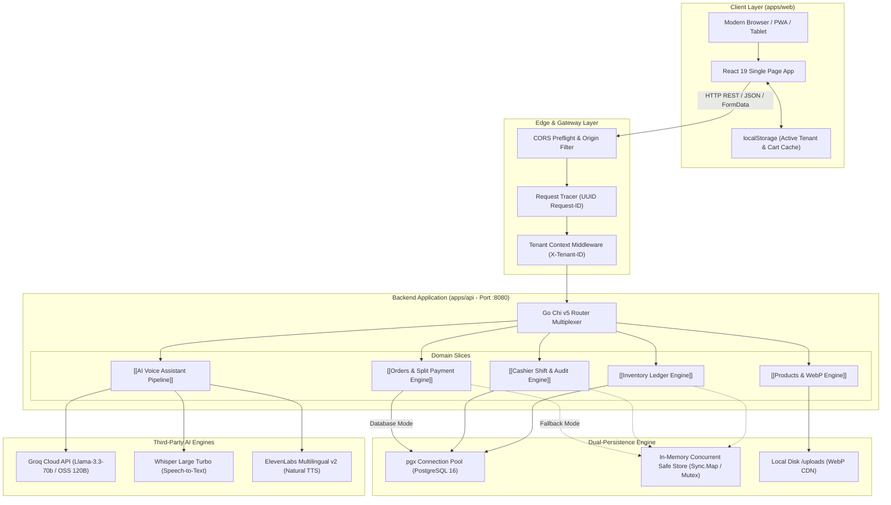

# 🏛️ System Topology

Topologi sistem **PawPOS** mengadopsi model **Client-Server Single-Origin Hybrid Architecture** yang mengedepankan latensi rendah, determinisme data, dan toleransi kegagalan jaringan.

---

## 🔍 Detail Lapisan Komponen

### 1. Client Layer (`apps/web`)
- Dibangun menggunakan **React 19**, **TypeScript 5.7**, dan **Vite 6**.
- Mengadopsi library antarmuka **Material-UI v7** yang di-customize dengan *Warm Charcoal / Vibrant Orange* design tokens.
- Berkomunikasi ke API backend melalui klien HTTP fetch ber-tipe ketat dengan penyematan header `X-Tenant-ID`.
- Memiliki proteksi *safe area* mobile penuh untuk kasir pengguna tablet iPad maupun smartphone Android/iPhone.
- Baca selengkapnya: [[React 19 Frontend Architecture]] dan [[Mobile-First & Safe Area System]].

### 2. Network & Gateway Middleware
- **Request ID Middleware**: Memberikan tag unik `request_id` pada setiap permintaan HTTP yang diteruskan ke log dan envelope response JSON.
- **Tenant Context Middleware**: Menangkap nilai `X-Tenant-ID` dan menyimpannya ke dalam `context.Context` Go untuk memastikan seluruh kueri database terisolasi.
- Baca selengkapnya: [[Chi Router & Middlewares]] dan [[Multi-Tenancy Isolation]].

### 3. Backend Engine (`apps/api`)
- Menggunakan **Go 1.23+** dengan router **Chi v5** yang sangat ringan tanpa alokasi memori berlebih.
- Mengadopsi arsitektur Clean DDD (*Domain-Driven Design*) per modul: `orders`, `shifts`, `inventory`, `products`, `assistant`, dan `tenant`.
- Baca selengkapnya: [[Go Clean Architecture]].

### 4. Storage & Fallback Layer
- **PostgreSQL 16**: Penyimpanan primer ACID-compliant dengan foreign keys ketat dan indeks performa tinggi.
- **In-Memory Fallback**: Ketika database PostgreSQL belum berjalan atau sedang maintenance, server Go secara otomatis beralih ke penyimpanan memori lokal tanpa mematikan aplikasi.
- Baca selengkapnya: [[Dual Persistence Engine]] dan [[Database Schema & DDL]].

### 5. Third-Party AI Services
- **Groq AI**: Menyediakan inferensi LLM ultra-cepat (~300+ token per detik) untuk menjawab pertanyaan kasir mengenai pakan atau aturan transaksi.
- **ElevenLabs**: Menghasilkan suara asisten kasir yang alami dalam Bahasa Indonesia.
- Baca selengkapnya: [[AI Voice Assistant Pipeline]].

---
*Kembali ke:* [[00 - PawPOS Second Brain MOC]]
