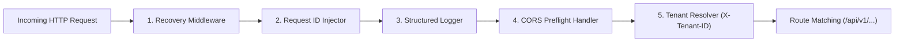

# 🛣️ Chi Router & Middlewares

Backend **PawPOS** menggunakan **Chi v5** (`github.com/go-chi/chi/v5`) sebagai HTTP router. Chi dipilih karena 100% kompatibel dengan standard library `net/http` Go, memiliki performa routing berbasis radix-tree yang sangat cepat, dan meminimalkan alokasi memori heap.

---

## ⛓️ Rantai Middleware (Middleware Chain)

Setiap request HTTP yang masuk melewati urutan middleware berikut sebelum mencapai domain handler:

### 1. Recovery Middleware
- Menangkap setiap `panic` tak terduga dalam eksekusi handler.
- Menghindari server crash dan secara anggun mengembalikan status `500 Internal Server Error` dengan log trace.

### 2. Request ID Middleware
- Menghasilkan UUID unik (misal: `4c30c4154320600b4bac7da8245d4866`) untuk setiap request.
- Menyematkan `request_id` pada response header dan envelope JSON untuk memudahkan penelusuran bug (*distributed tracing*).

### 3. CORS Handler
- Mengizinkan komunikasi lintas domain dari `http://localhost:5173` (Vite) atau domain produksi Vercel/Cloudflare Pages.
- Mengizinkan methods: `GET, POST, PUT, DELETE, OPTIONS`.
- Mengekspos header: `X-Tenant-ID, Content-Type, Authorization`.

### 4. Tenant Resolver Middleware
- Mengekstrak header `X-Tenant-ID`.
- Memvalidasi format UUID.
- Menyimpannya ke context: `ctx = context.WithValue(r.Context(), tenantKey, tenantID)`.

---

## 🗺️ Peta Endpoint REST API (`/api/v1`)

| Endpoint | Method | Fungsi | Modul Terkait |
| :--- | :---: | :--- | :--- |
| `/health/live` | GET | Liveness probe Kubernetes / Docker | System |
| `/health/ready` | GET | Readiness probe status DB | System |
| `/api/v1/ping` | GET | Ping check responsivitas server | System |
| `/api/v1/tenants/current` | GET | Mendapatkan profil toko aktif | [[Multi-Tenancy Isolation]] |
| `/api/v1/products` | GET | List katalog produk toko | [[Products & WebP Engine]] |
| `/api/v1/products` | POST | Tambah produk SKU baru | [[Products & WebP Engine]] |
| `/api/v1/products/{id}` | PUT | Perbarui harga / data produk | [[Products & WebP Engine]] |
| `/api/v1/inventory/stocks`| GET | Saldo fisik stok per outlet | [[Inventory Ledger Engine]] |
| `/api/v1/inventory/movements`| POST | Catat mutasi stok masuk/keluar | [[Inventory Ledger Engine]] |
| `/api/v1/orders` | POST | Checkout kasir (Tunai / Split) | [[Orders & Split Payment Engine]] |
| `/api/v1/orders` | GET | Riwayat transaksi order penjualan | [[Orders & Split Payment Engine]] |
| `/api/v1/shifts/current` | GET | Cek status shift kasir saat ini | [[Cashier Shift & Audit Engine]] |
| `/api/v1/shifts/open` | POST | Buka shift kasir & modal awal | [[Cashier Shift & Audit Engine]] |
| `/api/v1/shifts/close` | POST | Tutup shift kasir & rekonsiliasi | [[Cashier Shift & Audit Engine]] |
| `/api/v1/assistant/transcriptions` | POST | Transkripsi audio suara kasir | [[AI Voice Assistant Pipeline]] |
| `/api/v1/assistant/chat` | POST | Tanya asisten Groq LLM RAG | [[Groq 120B & Whisper Large Turbo]] |
| `/uploads/*` | GET | Static file server gambar WebP | [[Products & WebP Engine]] |

---
*Kembali ke:* [[00 - PawPOS Second Brain MOC]] | *Topik Terkait:* [[Go Clean Architecture]], [[Database Schema & DDL]]
