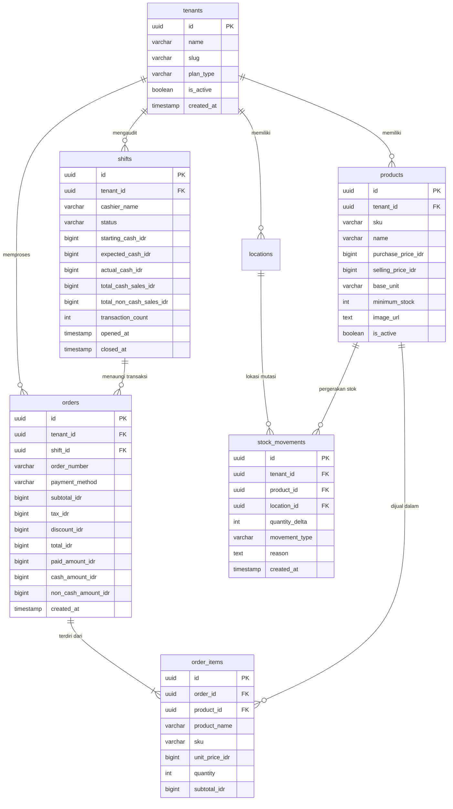

# 🗄️ Database Schema & DDL

Database utama **PawPOS** menggunakan **PostgreSQL 16**. Struktur tabel didesain dengan relasi foreign key ketat, tipe data UUID untuk primary key, dan isolasi multi-tenant pada setiap entitas.

---

## 🗺️ Entity Relationship Diagram (ERD)



---

## ⚡ Indeks Performa Kritis

Untuk menjamin kueri kasir tetap merespons di bawah 5 milidetik meskipun telah ada jutaan baris data transaksi:

1. **Indeks SKU Unik per Tenant**:
   ```sql
   CREATE UNIQUE INDEX idx_products_tenant_sku ON products(tenant_id, sku);
   ```
2. **Indeks Riwayat Transaksi per Waktu**:
   ```sql
   CREATE INDEX idx_orders_tenant_created ON orders(tenant_id, created_at DESC);
   ```
3. **Indeks Saldo Mutasi Stok**:
   ```sql
   CREATE INDEX idx_stock_movements_prod_loc ON stock_movements(tenant_id, product_id, location_id);
   ```
4. **Indeks Shift Kasir Aktif**:
   ```sql
   CREATE INDEX idx_shifts_tenant_status ON shifts(tenant_id, status) WHERE status = 'open';
   ```

---
*Kembali ke:* [[00 - PawPOS Second Brain MOC]] | *Topik Terkait:* [[Dual Persistence Engine]], [[Go Clean Architecture]]
