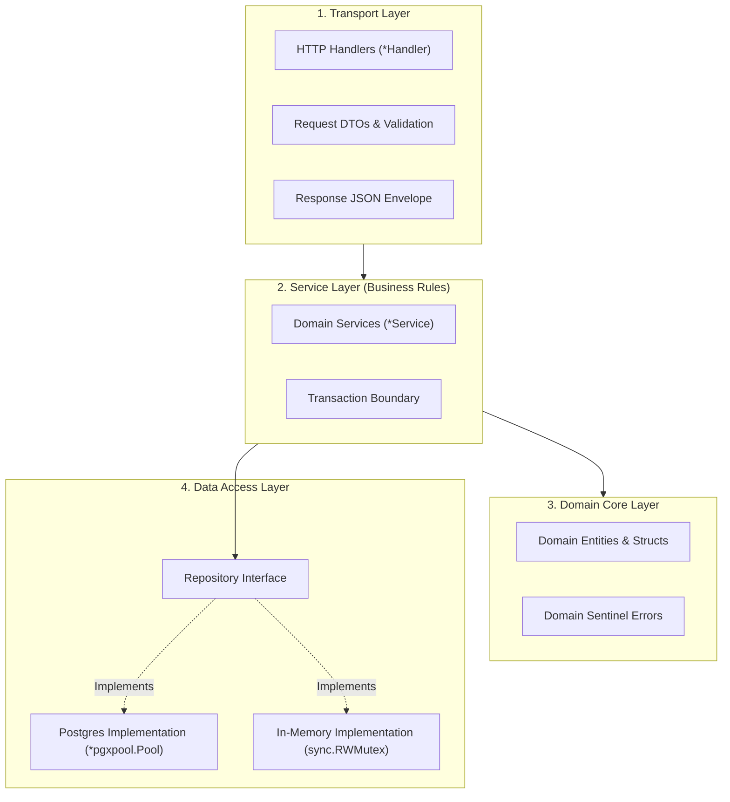

# 🏗️ Go Clean Architecture

Backend **PawPOS** (`apps/api`) dibangun menggunakan prinsip **Clean Architecture & Domain-Driven Design (DDD)** yang diadaptasi secara pragmatis untuk bahasa Go. 

Tujuannya adalah memastikan logika bisnis inti (*domain rules*) tidak terikat secara kaku pada framework HTTP maupun implementasi database tertentu.

---

## 🏛️ Pembagian Lapisan (Layer Structure)

Setiap modul di `apps/api/internal/` dibagi menjadi 4 komponen:



---

## 📋 Detail Lapisan

### 1. Transport Layer (`*Handler`)
- **Tugas**: Menerima request HTTP dari router Chi, mem-parsing query parameter atau request body JSON, dan memvalidasi tipe data awal.
- **Respons**: Selalu mengembalikan format envelope standar PawPOS:
  ```json
  {
    "data": { ... },
    "request_id": "4c30c4154320600b4bac7da8245d4866"
  }
  ```
- **Error Response**:
  ```json
  {
    "error": {
      "code": "INSUFFICIENT_STOCK",
      "message": "Stok produk Royal Canin tersisa 2, diminta 5."
    },
    "request_id": "4c30c4154320600b4bac7da8245d4866"
  }
  ```

### 2. Service Layer (`*Service`)
- **Tugas**: Menjalankan alur transaksi bisnis, misalnya:
  1. Memeriksa apakah shift kasir sedang berstatus `open` sebelum memproses checkout.
  2. Menghitung total belanja, diskon, dan pajak.
  3. Memastikan jumlah nominal *Split Payment* (`cash + non_cash`) sama persis dengan total tagihan.
  4. Mengurangi saldo stok barang di modul inventori.
- **Isolasi**: Tidak mengetahui detail SQL atau protokol HTTP.

### 3. Domain Layer
- Mendefinisikan struct inti murni Go:
  - `Product`, `Order`, `OrderItem`, `Shift`, `StockMovement`.
- Mendefinisikan konstanta dan error bisnis yang jelas:
  ```go
  var (
      ErrShiftAlreadyOpen   = errors.New("shift kasir sedang aktif")
      ErrShiftNotFound      = errors.New("tidak ada shift aktif untuk kasir ini")
      ErrInvalidPaymentSum  = errors.New("total pembayaran split tidak cocok dengan tagihan")
  )
  ```

### 4. Repository Layer (`Repository Interface`)
- Menjadi gerbang abstraksi data.
- Memungkinkan beralih antara database PostgreSQL riil dan memori palsu (*in-memory*) secara instan tanpa mengubah 1 baris pun kode service.
- Baca selengkapnya: [[Dual Persistence Engine]].

---
*Kembali ke:* [[00 - PawPOS Second Brain MOC]] | *Topik Terkait:* [[Chi Router & Middlewares]], [[Orders & Split Payment Engine]]
