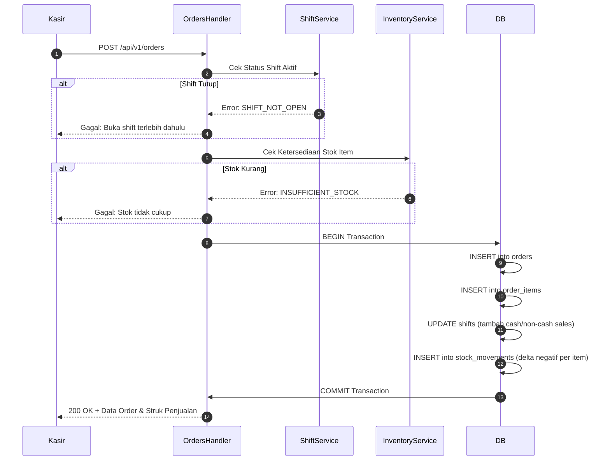

# 💳 Orders & Split Payment Engine

Modul **Orders** (`apps/api/internal/orders`) adalah mesin transaksi inti pada PawPOS yang bertanggung jawab atas proses checkout kasir, validasi kalkulasi harga, pemotongan stok otomatis, dan pembagian metode pembayaran (**Multi-Tender Split Payment**).

---

## 📐 Formula Kalkulasi Transaksi

Setiap order kasir diproses dengan rumus akuntansi deterministik tanpa pembulatan desimal tak menentu:

$$\text{Subtotal} = \sum (\text{Harga Satuan} \times \text{Kuantitas})$$
$$\text{Total Akhir} = (\text{Subtotal} - \text{Diskon}) + \text{Pajak}$$
$$\text{Kembalian} = \text{Uang Diterima} - \text{Total Akhir}$$

---

## 🔀 Multi-Tender Split Payment

Di toko retail fisik pet shop, sering kali pembeli ingin membayar sebagian belanjaan secara tunai (misal menghabiskan uang receh) dan sisanya menggunakan QRIS atau kartu debit.

PawPOS mendukung metode `split`:
```json
{
  "location_id": "loc-main",
  "payment_method": "split",
  "total_idr": 283500,
  "paid_amount_idr": 283500,
  "cash_amount_idr": 100000,
  "non_cash_amount_idr": 183500,
  "items": [ ... ]
}
```

### Aturan Validasi Split Payment:
1. **Integritas Jumlah**:
   $$\text{cash\_amount\_idr} + \text{non\_cash\_amount\_idr} == \text{total\_idr}$$
   Jika jumlah kedua komponen tidak sama dengan total tagihan, server menolak transaksi dengan kode error `INVALID_SPLIT_SUM`.
2. **Dampak ke Kas Laci Shift**:
   Hanya porsi `cash_amount_idr` yang dimasukkan ke perhitungan estimasi uang kas fisik di laci kasir (`total_cash_sales_idr` pada [[Cashier Shift & Audit Engine]]).
   Porsi `non_cash_amount_idr` dialokasikan ke pos non-tunai digital.

---

## ⚡ Alur Eksekusi Transaksi Atomik (Atomic Execution Flow)

Ketika kasir menekan tombol "Bayar":


---
*Kembali ke:* [[00 - PawPOS Second Brain MOC]] | *Topik Terkait:* [[Multi-Tender Settlement Flow]], [[Cashier Shift & Audit Engine]]
