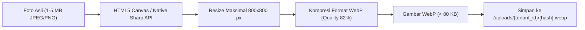

# 🐱 Products & WebP Engine

Katalog produk di pet shop memiliki karakteristik unik:
- Banyak varian berat (misal: pakan kucing 400g, 1.2kg, 2kg, 10kg).
- Setiap produk memiliki foto kemasan agar kasir tidak salah mengambil varian makanan basah (*wet food*) vs makanan kering (*dry food*).
- Gambar produk berukuran besar dapat memperlambat loading terminal kasir di tablet POS.

Modul **Products** (`apps/api/internal/products`) dan utilitas frontend menangani master data SKU dan optimasi kompresi citra berbasis **WebP**.

---

## 🖼️ Pipeline Kompresi Gambar WebP

Ketika kasir mengunggah gambar produk (format JPEG, PNG, HEIC dari kamera HP kasir):


### Manfaat Operasional:
1. **Penghematan Bandwidth hingga 85%**: Gambar kemasan pakan yang semula 3 MB terkompresi menjadi ~45 KB tanpa degradasi visual mata manusia.
2. **Kecepatan Rendering Kasir POS**: Grid produk di terminal kasir memuat puluhan item dalam waktu kurang dari 100ms.
3. **Penyajian Cepat**: Server static Go menyajikan berkas `/uploads/*` dengan header HTTP cache `Cache-Control: public, max-age=31536000`.

---

## 🏷️ Entitas Produk SKU

```go
type Product struct {
    ID               string    `json:"id"`
    TenantID         string    `json:"tenant_id"`
    CategoryID       *string   `json:"category_id,omitempty"`
    SKU              string    `json:"sku"`
    Name             string    `json:"name"`
    PurchasePriceIDR int64     `json:"purchase_price_idr"`
    SellingPriceIDR  int64     `json:"selling_price_idr"`
    BaseUnit         string    `json:"base_unit"` // "bag", "sachet", "bottle", "pcs"
    MinimumStock     int       `json:"minimum_stock"`
    ImageURL         *string   `json:"image_url,omitempty"`
    IsActive         bool      `json:"is_active"`
    CreatedAt        time.Time `json:"created_at"`
    UpdatedAt        time.Time `json:"updated_at"`
}
```

---
*Kembali ke:* [[00 - PawPOS Second Brain MOC]] | *Topik Terkait:* [[Inventory Ledger Engine]], [[POS Terminal & Cart State]]
