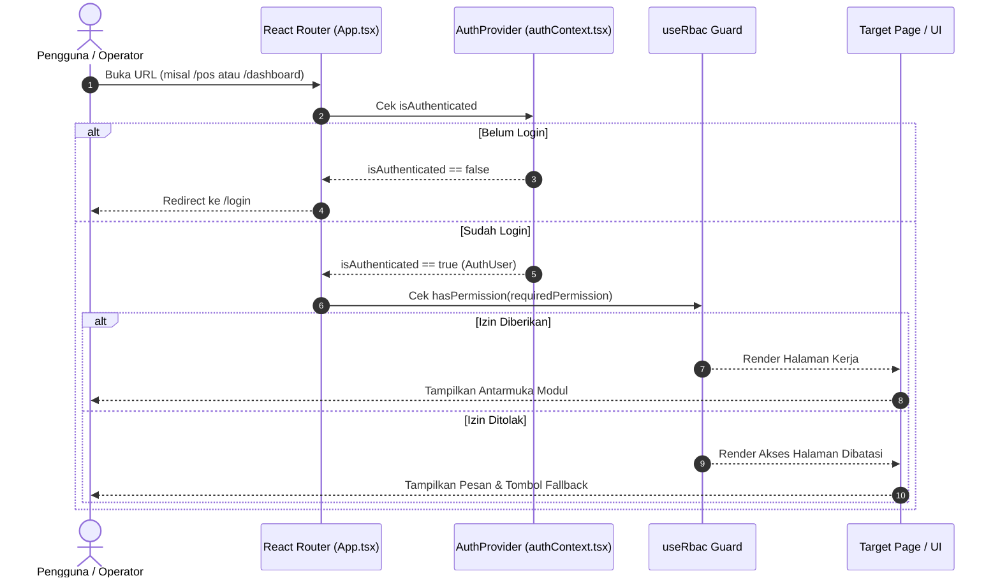

# Demo Trial & Role Isolation Architecture

Sistem autentikasi dan isolasi peran (**Role Isolation**) pada PawPOS dirancang untuk memastikan pemisahan tugas operasional (*separation of duties*) antara Pemilik Toko (**Owner**), Kasir (**Cashier**), Staf Gudang (**Warehouse**), dan Manajer (**Manager**).

---

## 🎯 Latar Belakang & Filosofi Desain

Pada sistem POS retail terdahulu, pergantian peran (*staff switcher*) sering diletakkan langsung pada antarmuka kasir (misalnya dropdown di sidebar). Namun dalam audit operasional nyata:
1. **Risiko Manipulasi Kasir**: Kasir dapat dengan mudah beralih menjadi peran Owner atau Manajer untuk melihat laporan margin laba, mengubah harga jual barang, atau menghapus mutasi kas laci.
2. **Ketiadaan Akuntabilitas Shift**: Sesi shift kasir dan pencatatan laci kas membutuhkan staf yang teridentifikasi secara presisi tanpa campur aduk sesi.

**Solusi PawPOS**:
- Menghilangkan *inline role switcher* dari sidebar.
- Mewajibkan autentikasi berbasis kredensial akun individu.
- Menyediakan mode **Demo Trial 1-Klik** untuk evaluasi langsung tanpa registrasi manual yang rumit.
- Mengunci akses menu dan modul secara reaktif melalui **RBAC Guard**.

---

## 👥 Persona & Akun Demo Uji Coba

| Peran | Email | Sandi | Initial Route | Hak Akses Utama | Batasan Ketat |
| :--- | :--- | :--- | :--- | :--- | :--- |
| 👑 **Owner** | `owner@pawpos.id` | `pawpos123` | `/dashboard` | Akses penuh 100% ke seluruh modul. | Tidak ada batasan. |
| 💳 **Kasir** | `kasir@pawpos.id` | `kasir123` | `/pos` | Terminal kasir POS, split payment, cetak struk, buka/tutup shift kasir. | Menu Dashboard analitik, inventori stok fisik, dan pengaturan toko dikunci. |
| 📦 **Staf Gudang** | `gudang@pawpos.id` | `gudang123` | `/inventory/stocks` | Inbound barang supplier, mutasi keluar, penyesuaian fisik, katalog produk. | Terminal kasir POS dan dashboard omset toko dikunci. |
| 📋 **Manajer** | `manager@pawpos.id` | `manager123` | `/dashboard` | Supervisi kasir, audit laci kas harian, monitoring mutasi stok, katalog produk. | Konfigurasi master toko dibatasi. |

---

## 🔒 Alur Keamanan & Perlindungan Rute (Route Guard)

---

## 🚪 Komponen Profil & Prosedur Logout

- **Komponen**: `UserProfileCard.tsx` terletak di sidebar kiri (menggantikan `StaffSwitcher.tsx`).
- **Tampilan**:
  - Avatar emoji peran (`👑`, `💳`, `📦`, `📋`)
  - Nama staf & chip peran berwarna (*color-coded badge*)
  - Tombol ikon **Keluar (Logout)**
- **Konfirmasi Modal**: Menampilkan dialog peringatan konfirmasi sebelum menghapus sesi aktif di `localStorage`.

---

## 🔗 Referensi Terkait
- [[React 19 Frontend Architecture]]
- [[POS Terminal & Cart State]]
- [[Multi-Tenancy Isolation]]
- [[00 - PawPOS Second Brain MOC]]
