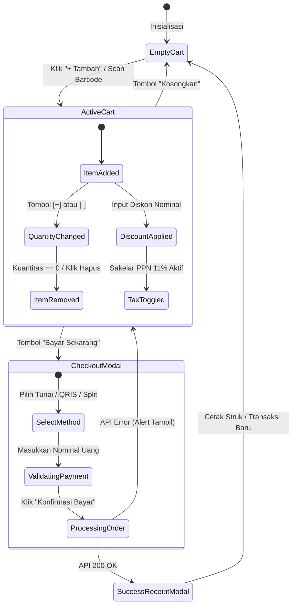

# 🛒 POS Terminal & Cart State

Terminal Kasir POS (`src/features/pos/PosPage.tsx`) adalah antarmuka paling krusial dalam sistem PawPOS. Terminal ini harus memfasilitasi penambahan barang kilat, penyesuaian kuantitas dengan 1 klik/ketukan, kalkulasi diskon, dan pemilihan metode pembayaran tanpa ada jeda.

---

## 🔄 State Machine Keranjang Kasir (Cart State)



---

## 🗃️ Tipe Struktur Data Keranjang

```ts
export interface CartItem {
  product_id: string
  name: string
  sku: string
  price: number
  quantity: number
  available_stock: number
  base_unit: string
}

export interface CartSummary {
  subtotal: number
  discount: number
  taxRate: number // 0.11 jika aktif
  taxAmount: number
  total: number
}
```

---

## 🛡️ Guardrails Transaksi Kasir

1. **Pemeriksaan Shift Aktif**:
   Jika shift kasir belum dibuka, terminal menampilkan banner peringatan di bagian atas:
   `"Shift Kasir Belum Dibuka: Buka shift kasir untuk mencatat modal kas laci awal"` dan tombol "Bayar Sekarang" dinonaktifkan secara otomatis.
2. **Validasi Batas Stok**:
   Tombol `[+]` kuantitas otomatis terkunci ketika kuantitas keranjang telah mencapai `available_stock` produk saat ini untuk mencegah kasir menjual barang yang fisiknya tidak ada di toko.
3. **Pemberitahuan Suara Transaksi**:
   Saat transaksi sukses, sistem memutar suara konfirmasi mikro dan membuka dialog struk penjualan dengan opsi cetak printer thermal (58mm / 80mm).

---
*Kembali ke:* [[00 - PawPOS Second Brain MOC]] | *Topik Terkait:* [[POS Checkout Workflow]], [[Multi-Tender Settlement Flow]]
