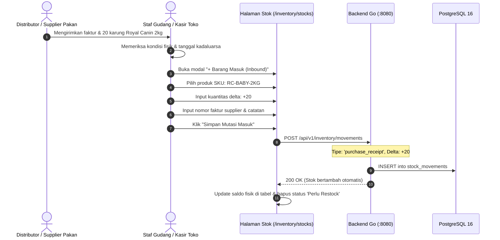

# 📦 Inventory Movement Workflow

Alur kerja pergerakan stok (**Inventory Movement Workflow**) di PawPOS memfasilitasi pencatatan barang dari saat distributor mengirimkan pakan hewan, penyimpanan di rak toko, hingga pengurangan saat transaksi penjualan kasir.

---

## 🔄 Alur Penerimaan Barang Masuk (Inbound Supply)

---

## 📉 Alur Pengurangan Barang Penjualan (Outbound Sale)

1. Pelanggan membeli 2 kaleng makanan basah Whiskas di terminal kasir.
2. Ketika kasir menekan tombol "Bayar" dan checkout sukses:
   - Modul Orders otomatis menerbitkan `stock_movements` dengan tipe `sale` dan nilai kuantitas `-2`.
   - Tidak ada jeda atau proses background yang tertunda; stok langsung berkurang secara *real-time*.
3. Jika saldo stok turun hingga di bawah batas minimum (`minimum_stock`), label `Perlu Restock` otomatis muncul di baris tabel inventori dan kartu dashboard.

---

## 🔍 Alur Penyesuaian Stock Opname (Audit Adjustment)

Jika saat penghitungan fisik di rak ditemukan 1 kaleng pakan yang penyok/bocor:
1. Staf membuka modal **"Catat Penyesuaian (Adjustment)"**.
2. Memasukkan kuantitas `-1` dengan alasan: *"Kemasan rusak/bocor saat penataan rak"*.
3. Saldo fisik disesuaikan dengan tetap menjaga riwayat pertanggungjawaban di buku ledger.

---
*Kembali ke:* [[00 - PawPOS Second Brain MOC]] | *Topik Terkait:* [[Inventory Ledger Engine]], [[Products & WebP Engine]]
