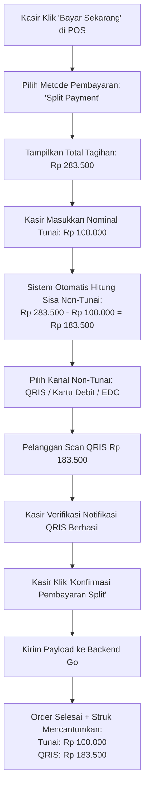

# 💳 Multi-Tender Settlement Flow

Pelanggan pet shop kerap membeli barang dalam jumlah besar (misal pakan karung 10kg seharga ratusan ribu) dan meminta pembayaran dipecah: sebagian uang tunai sisa di dompet dan sisanya dibayar menggunakan QRIS / Kartu Debit.

Alur penyelesaian transaksi campuran (**Multi-Tender Settlement Flow**) di PawPOS didesain agar kasir tidak perlu menghitung manual dan pembukuan toko tetap presisi.

---

## 🔄 Alur Interaksi Kasir (User Flow)

---

## 🧮 Validasi Keamanan Transaksi

1. **Anti Selisih**: Sistem mencegah kasir mengonfirmasi transaksi jika:
   $$\text{Tunai} + \text{Non-Tunai} \ne \text{Total Tagihan}$$
2. **Kalkulasi Kembalian Otomatis**: Jika pelanggan menyerahkan uang kertas pecahan lebih besar dari porsi tunai (misal porsi tunai Rp 83.500 diserahkan uang Rp 100.000), sistem otomatis menghitung kembalian `Rp 16.500`.
3. **Pemisahan di Laporan Shift**:
   - Porsi Tunai masuk ke pos kas fisik laci (`total_cash_sales_idr`).
   - Porsi Non-Tunai masuk ke pos digital (`total_non_cash_sales_idr`).

---
*Kembali ke:* [[00 - PawPOS Second Brain MOC]] | *Topik Terkait:* [[Orders & Split Payment Engine]], [[POS Checkout Workflow]]
