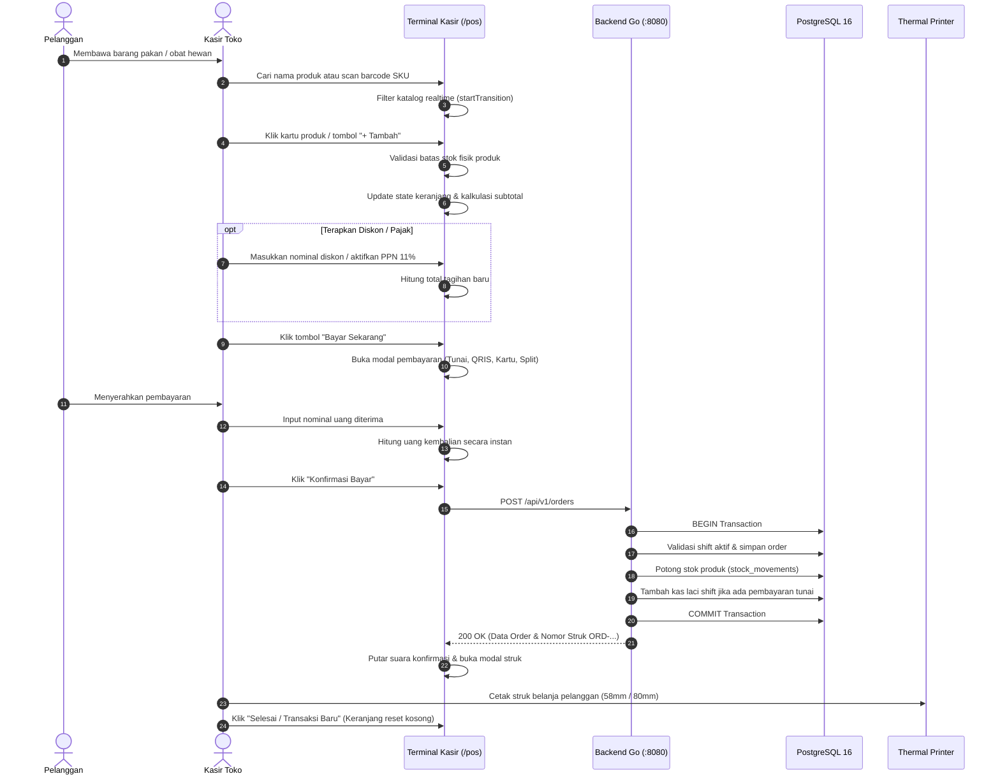

# 🛒 POS Checkout Workflow

Berikut adalah alur kerja operasional lengkap dari awal pelanggan membawa barang ke kasir hingga kasir mencetak struk belanja di PawPOS:

---

## 🛑 Kondisi Pengecualian & Penanganannya

1. **Shift Kasir Belum Dibuka**:
   - Jika kasir menekan tombol "Bayar", sistem akan memblokir transaksi dengan alert: *"Sesi kasir saat ini belum aktif. Silakan buka shift kasir terlebih dahulu"*.
   - Kasir dialihkan langsung ke modal pembukaan shift tanpa kehilangan isi keranjang belanja yang sudah dipilih.
2. **Kuantitas Melebihi Stok Tersedia**:
   - Tombol `[+]` kuantitas otomatis terkunci jika kuantitas keranjang telah menyamai stok yang tersisa di toko.
3. **Koneksi Internet Terputus**:
   - Jika jaringan toko terganggu sesaat, pesanan dapat disimpan sementara di antrean lokal (*local draft queue*) agar kasir tidak panik di depan pelanggan.

---
*Kembali ke:* [[00 - PawPOS Second Brain MOC]] | *Topik Terkait:* [[Multi-Tender Settlement Flow]], [[POS Terminal & Cart State]]
