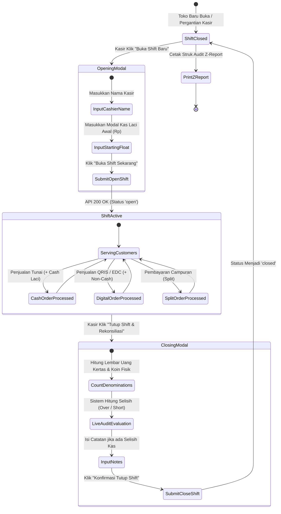

# 🔄 Shift Lifecycle & Z-Report Workflow

Siklus hidup shift kasir adalah rangkaian prosedur operasional toko dari awal kasir masuk kerja di pagi hari, memproses transaksi sepanjang hari, hingga penyerahan kas dan pencetakan struk Z-Report di akhir hari.

---

## 📋 Tahap-Tahap Siklus Shift

### 1. Tahap Pembukaan Shift (Shift Inbound)
- Kasir membuka aplikasi di `/shifts` atau langsung dari banner `/pos`.
- Mengisi nama kasir yang bertanggung jawab (misal: *"Rizky"*).
- Menghitung uang modal kas kecil (*float*) yang diberikan pemilik toko untuk uang kembalian (misal: `Rp 200.000`).
- Mengklik **"Buka Shift Sekarang"** — Status shift menjadi `open`.

### 2. Tahap Operasional Aktif (Shift In-Flight)
- Setiap transaksi tunai secara atomik menambah nilai `total_cash_sales_idr` dan `expected_cash_idr` pada record shift tersebut.
- Dashboard dan header terminal kasir selalu menampilkan estimasi kas laci secara *live*.

### 3. Tahap Penutupan & Rekonsiliasi (Shift Outbound / Z-Report)
- Di akhir shift, kasir mengeluarkan uang dari laci dan menghitungnya menggunakan [[Cash Denomination Calculator]].
- Sistem membandingkan uang fisik dengan catatan sistem:
  - Jika seimbang (`Selisih Rp 0`): Kasir dapat langsung menutup shift.
  - Jika ada selisih: Kasir wajib menuliskan penjelasan di kolom catatan sebelum penutupan dapat disetujui.
- Sistem menerbitkan **Z-Report** yang berisi rekapitulasi penjualan harian. Shift terkunci dan kasir berikutnya dapat membuka shift baru.

---
*Kembali ke:* [[00 - PawPOS Second Brain MOC]] | *Topik Terkait:* [[Cashier Shift & Audit Engine]], [[Cash Denomination Calculator]]
