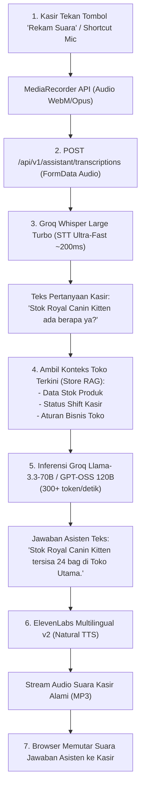

# 🎙️ AI Voice Assistant Pipeline

Di tengah kesibukan kasir pet shop saat tangan memegang anjing/kucing pelanggan atau menimbang pakan karung, kasir tidak selalu dapat mengetikkan pertanyaan ke komputer.

**PawPOS AI Copilot** menyediakan asisten operasional suara hands-free (**Natural Voice Operational RAG**) yang memungkinkan kasir bertanya dengan suara dan mendengarkan jawaban asisten secara instan.

---

## 🌊 Pipeline Suara Hulu-ke-Hilir (End-to-End Voice Pipeline)

---

## 🎯 Use-Cases Utama AI Copilot di Meja Kasir

1. **Pengecekan Stok Kilat**:
   - *Kasir bertanya*: *"Cek stok pasir kucing gumpal lavender."*
   - *AI menjawab*: *"Pasir bentonite lavender masih ada 45 bag di Toko Utama."*
2. **Panduan Transaksi Khusus**:
   - *Kasir bertanya*: *"Bagaimana cara mencatat pembayaran split tunai dan QRIS?"*
   - *AI menjawab*: *"Pilih metode Split di modal bayar, masukkan porsi uang tunai yang diterima, dan biarkan sistem menghitung sisa tagihan QRIS secara otomatis."*
3. **Konsultasi Resep & Nutrisi Hewan**:
   - *Kasir bertanya*: *"Pelanggan tanya pakan untuk kucing yang kulitnya sensitif dan gatal."*
   - *AI menjawab*: *"Rekomendasikan Pro Plan Sensitive Skin & Stomach Salmon 2.5kg yang mengandung asam lemak Omega untuk kesehatan mantel bulu dan kulit kucing."*

---
*Kembali ke:* [[00 - PawPOS Second Brain MOC]] | *Topik Terkait:* [[Groq 120B & Whisper Large Turbo]], [[ElevenLabs Voice Synthesis]]
