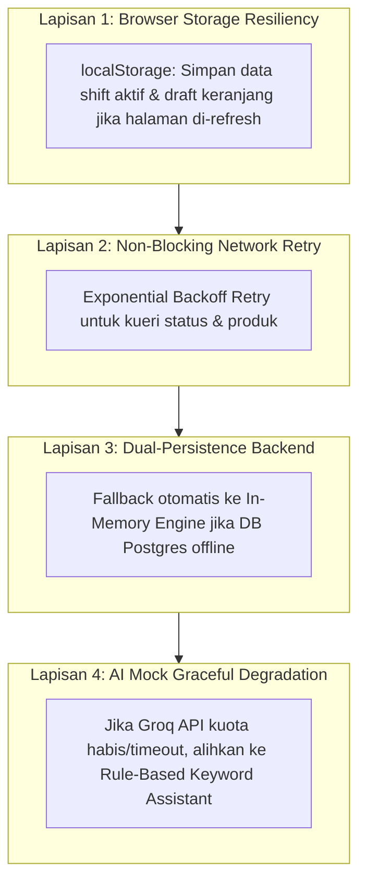

# 🛡️ Offline Fallback & Reliability

Keandalan (*reliability*) adalah harga mati untuk sistem kasir Point of Sale. Di lapangan nyata, koneksi internet toko bisa putus tiba-tiba, router Wi-Fi tersenggol, atau server cloud mengalami gangguan jaringan sementara.

PawPOS mengintegrasikan 4 lapisan pertahanan keandalan (**Four Layers of POS Reliability**):

---

## 🧱 4 Lapisan Keandalan PawPOS

---

## 🚦 Rencana Tanggap Darurat Kasir (Emergency Protocol)

| Skenario Insiden | Gejala | Respon Otomatis Sistem | Tindakan Kasir |
| :--- | :--- | :--- | :--- |
| **Koneksi Internet Putus** | Muncul snackbar *"Koneksi terputus"* | Klien web menahan data transaksi di antrean lokal (*offline queue*). | Kasir tetap melayani pembayaran tunai manual dengan struk sementara. |
| **Database Postgres Mati** | Log Go mencatat error koneksi DB | Go secara otomatis beralih ke [[Dual Persistence Engine]] (In-Memory). | Kasir tidak terganggu dan tetap dapat checkout serta cetak struk. |
| **Laci Kas Selisih** | Selisih kas merah di audit shift | Sistem mewajibkan input alasan di [[Cash Denomination Calculator]]. | Kasir memasukkan catatan penyebab sebelum shift ditutup. |
| **Printer Thermal Macet** | Kertas struk habis saat cetak | Tombol *"Cetak Ulang Struk"* selalu tersedia di riwayat `/orders`. | Kasir mengganti kertas dan menekan tombol cetak ulang tanpa membatalkan order. |

---
*Kembali ke:* [[00 - PawPOS Second Brain MOC]] | *Topik Terkait:* [[Dual Persistence Engine]], [[Local Dev & Testing Runbook]]
